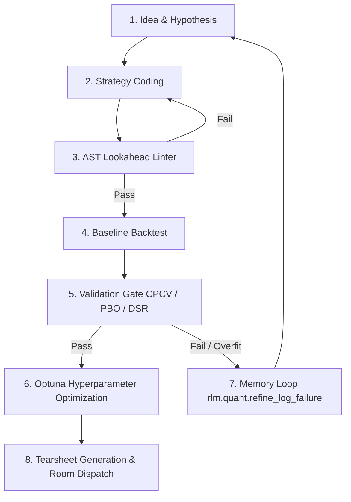

# Strategy Formulation & Interactive Quant Workflow

PRIME QUANT is an autonomous, agentic quant development environment (operated via interactive TUI, CLI, and Web UI) designed to turn trading ideas into backtested, overfit-validated, and execution-ready strategies.

---

## 1. Operating PRIME QUANT (Interactive Mode)

Start the interactive terminal session using the fast launcher:

```powershell
# Windows
.\prime-quant.cmd

# Or with the Web GUI live
.\prime-quant.cmd gui
```

You can prompt PRIME QUANT directly in natural language to research, code, test, and refine strategies.

---

## 2. The 7-Step Quant Development Loop

Every strategy created in PRIME QUANT follows a strict, quantitative lifecycle:



### Step 1: Formulate the Hypothesis
Describe the market anomaly or edge in plain text or structured JSON (e.g. timeframe, session filter, volatility regime, entry and exit conditions).

### Step 2: Code the Strategy
Implement a clean `Strategy` class in `primequant.strategy` emitting discrete lot targets (`-1.0`, `0.0`, `+1.0`):

```python
from dataclasses import dataclass
import polars as pl
from primequant.strategy import Strategy, SignalResult
from primequant.data.loader import CANON_CLOSE, CANON_TIME

@dataclass
class CustomMomentumStrategy(Strategy):
    period: int = 20
    name: str = "custom_mom"

    def prepare(self, df: pl.DataFrame) -> pl.DataFrame:
        return df.with_columns(
            pl.col(CANON_CLOSE).rolling_mean(self.period).alias("sma")
        )

    def signals(self, df: pl.DataFrame) -> SignalResult:
        prepared = self.prepare(df)
        target = (
            pl.when(pl.col(CANON_CLOSE) > pl.col("sma"))
            .then(1.0)
            .otherwise(0.0)
        )
        return SignalResult(df=prepared.with_columns(target.alias("target_lots")).select(CANON_TIME, "target_lots"))
```

### Step 3: AST Lookahead Linter
Before any backtest runs, static AST analysis ensures:
- **No $t+1$ lookahead**: Blocks negative shifts (`.shift(-k)`).
- **No global normalization**: Blocks fitting scalers (`StandardScaler.fit()`) across the whole sample.

### Step 4: Baseline Backtest
Calculates execution returns with realistic spread costs, commissions, and slippage. Produces Sharpe, Sortino, Calmar, Max Drawdown %, Profit Factor, and Win Rate.

### Step 5: Validation Gate
Evaluates robustness against statistical overfitting:
- **Combinatorially Symmetric Cross-Validation (CPCV)**: Evaluates path-dependent train/test splits.
- **Deflated Sharpe Ratio (DSR)**: Corrects for trial selection bias.
- **Probability of Backtest Overfitting (PBO)**: Calculates risk of spurious results.

### Step 6: Parameter Optimization (Optuna)
Runs Bayesian search only when the baseline passes validation gates, discovering parameter stability islands.

### Step 7: Tearsheets & Room Dispatch
- Generates rich HTML tearsheets (`tearsheet_<symbol>_<tf>.html`).
- Automatically broadcasts links to the Web GUI and posts notifications into the `#research` room channel.
- Failed patterns are stored in `rlm.quant.recall_failures()` so subsequent ideas avoid known dead-ends.

---

## 3. Scheduled Watchers

To run recurring surveillance in the background:

```bash
# Schedule Risk Watcher (every 15 minutes)
prime-agent schedule --cron "*/15 * * * *" --prompt "Run Risk Watcher on active positions and report drawdown status into #risk-management"

# Schedule Flow Watcher (hourly)
prime-agent schedule --cron "0 * * * *" --prompt "Run Flow Watcher to scan EURUSD, GBPUSD, XAUUSD for volume spikes and report to #alerts"
```
